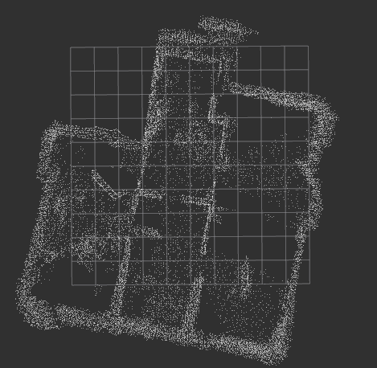
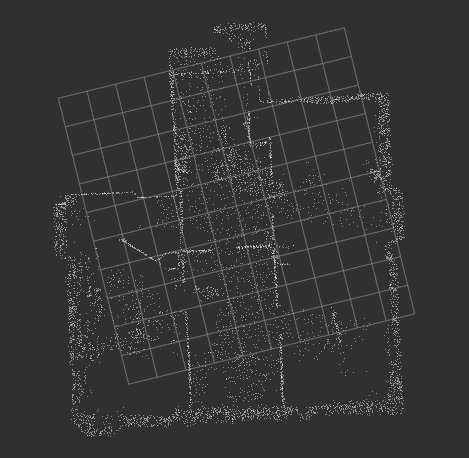
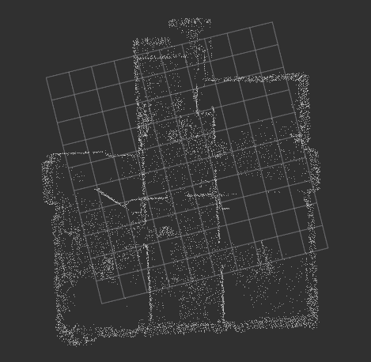
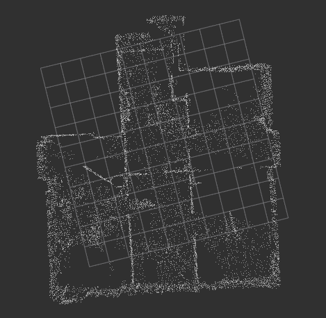
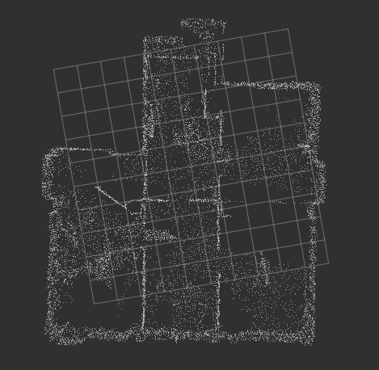
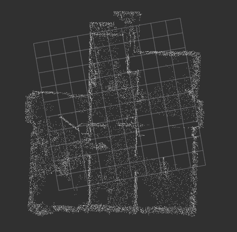

# 통신 방법
## Ros2 service
```
#Request
bool start
float32 hz
string target_frame
---
#Response
bool success
```
- start : accumulation 시작여부
- hz : 몇 hz 로 ICP를 진행할 것인지
- target_frame : 발행되는 토픽의 target_frame을 무엇으로 할 것인지
## service 실패조건
- hz <= 0 or hz > 10 : hz가 10을 넘을 경우 센서보다도 hz가 빠름
- target frame이 map 혹은 base가 아님

## service가 다시 한번 온다면?
기존 accumulation을 취소하고 새롭게 진행

# ICP 평가
## 평가 항목
- pcl icp
- pcl gicp
- fast gicp (threads: 1,4)
- fast vgicp (threads: 1,4)
- fast vgicp cuda

## 평가 컴퓨터 자원
- CPU : AMD 

- GPU : NVIDIA 4060Ti

- RAM : 16GB

## 결론
`최적` : fast_gicp thread 1개 -> hz=1 : cpu 60% 정도

`그다음` : fast_gicp thread 2개 -> hz=2

## 평가결과
### pcl_icp

rss_초기값 = 47808KB

평균

wall time : 31 ms

cpu/wall = 1.00807

rss = 54552KB

최대

wall time : 71ms

cpu/wall = 1.02187

rss = 57100KB

<p align="center">  </p>

==========================================

### pcl_gicp

rss_초기값 = 46234KB

평균

wall time : 2895.ms

cpu/wall = 1.0098

rss = 51020KB

최대

wall time : 4352.71ms

cpu/wall = 1.0103

rss = 52824KB

쌓일수록 선형적으로 증가하는 느낌

<p align="center">  </p>

==========================================

### fast_gicp (스레드 1개)

rss_초기값 = 45796KB

평균

wall time = 511 ms

cpu/wall = 1.01

rss = 67548KB

최대

wall time = 553 ms

cpu/wall = 1.01

rss = 68472KB

<p align="center">  </p>

--------------------------------------------

### fast_gicp (스레드 4개)

rss_초기값 = 45752KB

평균

wall time = 150 ms

cpu = 522 ms

cpu/wall = 3.6

rss = 69760 KB

최대

wall time = 246 ms

cpu = 918.518ms

cpu/wall = 3.779

rss = 69760 KB (동일)

<p align="center">  </p>

============================================

### fast_vgicp (스레드 1개)

rss_초기값 = 47164 KB

평균

wall time = 514.996 ms

cpu = 520.313 ms

cpu/wall = 1.01

rss = 70504 KB

최대

rss = 71096 KB

거의 동일

<p align="center">  </p>

------------------------------------------

### fast_vgicp ( 스레드 4개 )

rss_초기값 = 47064 KB

평균

wall time = 138 ms

cpu = 493 ms

cpu/wall = 3.63

최대

wall time = 151 ms

cpu = 512 ms

cpu/wall = 3.65

rss = 71904 KB

<p align="center">  </p>


=================================================

### fast_vgicp_cuda

rss_초기값 = 47084 KB

wall time = 50 ms

cpu/wall = 6.73

cpu/wall = 7.03

rss=157148 KB

GPU 사용량은 500MB 정도

<p align="center">  </p>