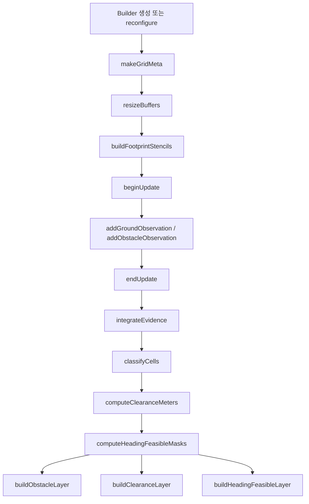

# Map Algorithm Flow

## 목적
이 문서는 현재 맵 알고리즘이 실제로 어떤 순서로 돌아가는지, 어떤 입력이 어떤 내부 상태를 거쳐 어떤 출력으로 나오는지 설명한다.

---

## 1. 초기화 단계

### 입력
- `Config`
- `Origin`

### 수행 함수
- `Builder::Builder()`
- 또는 `Builder::reconfigure()`

### 내부 순서
1. `config_` 저장
2. `meta_ = makeGridMeta(config_, origin)`
3. `resizeBuffers()`
4. `buildFootprintStencils()`

### 결과
- 맵 크기 확정
- 내부 evidence/state buffer 생성
- heading별 footprint stencil 미리 계산

---

## 2. 한 프레임 업데이트 시작

### 수행 함수
- `beginUpdate()`

### 하는 일
- `obstacle_hits_per_update_` 초기화
- `ground_hits_per_update_` 초기화

### 의미
- 이번 프레임의 raw 관측을 담을 임시 버퍼를 비운다.
- 이전 프레임의 persistent evidence는 유지한다.

---

## 3. 관측 입력

### 수행 함수
- `addGroundObservation()`
- `addObstacleObservation()`
- 또는 vector 버전

### 입력
- 전처리된 `ground` 포인트들
- 전처리된 `obstacle` 포인트들

### 내부 동작
1. NaN/inf 체크
2. `worldToIndex(meta_, x, y)`로 셀 변환
3. 유효 셀이면 해당 hit count 증가

### 결과
- 현재 프레임에 대한 raw hits가 셀별로 쌓인다.

---

## 4. Evidence 누적

### 수행 함수
- `endUpdate()` 내부의 `integrateEvidence()`

### 입력
- `obstacle_hits_per_update_`
- `ground_hits_per_update_`
- 이전까지 누적된 `evidence_scores_`

### 계산식

```text
obstacle_hits = min(raw_obstacle_hits, obstacle_hit_cap_per_update)
ground_hits   = min(raw_ground_hits,   ground_hit_cap_per_update)

delta_score = obstacle_weight * obstacle_hits
            - ground_weight   * ground_hits

evidence_scores[cell] =
  clamp(
    evidence_scores[cell] + delta_score,
    -evidence_clip_value,
    +evidence_clip_value
  )
```

### 의미
- obstacle 증거는 점수를 올린다.
- ground 증거는 점수를 내린다.
- 한 프레임에 너무 많은 점이 들어와도 cap으로 영향력을 제한한다.
- 예전에 본 셀은 decay 없이 계속 기억한다.

---

## 5. 셀 상태 판정

### 수행 함수
- `classifyCells()`

### 입력
- `evidence_scores_`

### 판정 규칙

```text
if evidence_score >= occupied_score_threshold:
    state = Obstacle
else if evidence_score <= -free_score_threshold:
    state = Free
else:
    state = previous state
```

### 의미
- score가 충분히 크면 obstacle
- score가 충분히 작으면 free
- 애매한 구간에서는 상태를 유지

### 결과
- `cell_states_` 생성
- 이 상태가 이후 모든 layer 계산의 기준이 된다.

---

## 6. Clearance 계산

### 수행 함수
- `computeClearanceMeters()`

### 입력
- `cell_states_`

### 내부 동작
1. obstacle 셀을 distance 0 seed로 priority queue에 넣음
2. 8-neighborhood로 거리 전파
3. 각 셀에 가장 가까운 obstacle까지의 근사 거리 저장

### 결과
- `clearance_m_`

### 의미
- 각 셀이 장애물에서 얼마나 떨어져 있는지 수치화한다.

---

## 7. Heading별 Feasibility 계산

### 수행 함수
- `computeHeadingFeasibleMasks()`

### 입력
- `cell_states_`
- 미리 계산된 `footprint_stencils_`

### 내부 동작
각 heading bin에 대해:
1. 모든 free 셀 순회
2. `footprintFitsAt(cell, heading)` 호출
3. stencil 아래 셀이 모두 free인지 검사
4. 가능하면 feasible mask에 1 저장

### 결과
- `heading_feasible_[k]`

### 의미
- 단순 `(x, y)` 가능 여부가 아니라 `(x, y, theta)` 자세 기준 가능 여부를 만든다.

---

## 8. Layer 출력

### `buildObstacleLayer()`
- obstacle: `100`
- free: `0`
- observed but undecided: `50`
- never observed: `-1`

### `buildClearanceLayer()`
- 관측된 셀의 clearance 값을 float로 반환
- 미관측 셀은 `-1`

### `buildHeadingFeasibleLayer(k)`
- 특정 heading에서 feasible이면 `100`
- 아니면 `0`
- 미관측 셀은 `-1`

---

## 9. 전체 순서 요약

```text
Builder 생성 또는 재설정
  -> meta 생성
  -> 내부 버퍼 생성
  -> footprint stencil 생성

한 프레임 시작
  -> beginUpdate()

ground / obstacle 포인트 입력
  -> addGroundObservation()
  -> addObstacleObservation()

프레임 종료
  -> integrateEvidence()
  -> classifyCells()
  -> computeClearanceMeters()
  -> computeHeadingFeasibleMasks()

필요한 레이어 조회
  -> buildObstacleLayer()
  -> buildClearanceLayer()
  -> buildHeadingFeasibleLayer()
```

---

## 10. Mermaid 순서도



---

## 11. 디버깅할 때 먼저 볼 순서

새 노드 붙이기 전에 이상 동작이 보이면 아래 순서로 보는 것이 좋다.

1. `worldToIndex()`가 기대한 셀로 들어가는지
2. `obstacle_hits_per_update_`, `ground_hits_per_update_`가 맞는지
3. `evidence_scores_`가 threshold 근처에서 어떻게 움직이는지
4. `cell_states_`가 기대대로 obstacle/free로 바뀌는지
5. `clearance_m_`가 obstacle 주변에서 자연스럽게 줄어드는지
6. `heading_feasible_`가 footprint 방향에 따라 다르게 나오는지

---

## 12. 현재 알고리즘의 해석

현재 알고리즘은 다음까지 책임진다.

- persistent map 형성
- obstacle/free 판정
- clearance 계산
- collision-feasible pose 계산

현재 알고리즘이 아직 책임지지 않는 것은 다음이다.

- target object 기반 interaction pose 생성
- nonholonomic reachable path 검사
- ROS topic 입출력
- sensor 전처리

즉 현재 코어는 "상호작용 접근 알고리즘의 바닥 맵"까지 담당하고,
최종 접근 planning은 다음 단계에서 붙는 구조다.
